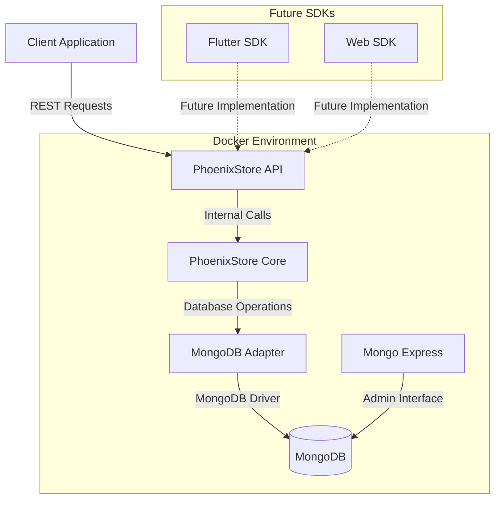

# PhoenixStore Architecture

## Overview

PhoenixStore is designed as a Firestore alternative for Flutter/Web projects, providing a familiar API with MongoDB as the backend. This document outlines the architectural decisions and system design.

## System Architecture



## Component Details

### 1. PhoenixStore API (REST Layer)
- Built with Elysia.js for high performance
- RESTful endpoints following Firestore patterns
- Swagger documentation for API exploration
- CORS support for cross-origin requests
- Future JWT authentication support

### 2. PhoenixStore Core
- Implements Firestore-like document/collection pattern
- Type-safe operations with TypeScript
- Handles data validation and transformation
- Manages database connections and pooling

### 3. MongoDB Adapter
- Abstracts MongoDB operations
- Handles connection management
- Implements retry logic and error handling
- Converts between Firestore and MongoDB query patterns

### 4. Supporting Services
- **Mongo Express**: Web-based MongoDB admin interface
- **Docker Compose**: Orchestrates all services
- **Environment Management**: `.env` file for configuration

## Data Flow

1. **Request Flow**
   ```mermaid
   sequenceDiagram
       Client->>+API: HTTP Request
       API->>+Core: Process Request
       Core->>+Adapter: Database Operation
       Adapter->>+MongoDB: Execute Query
       MongoDB-->>-Adapter: Return Results
       Adapter-->>-Core: Transform Data
       Core-->>-API: Format Response
       API-->>-Client: HTTP Response
   ```

2. **Error Handling Flow**
   ```mermaid
   sequenceDiagram
       participant C as Client
       participant A as API
       participant M as MongoDB
       
       C->>A: Request
       activate A
       A->>M: Query
       activate M
       alt Success
           M-->>A: Data
           A-->>C: 200 OK
       else Database Error
           M-->>A: Error
           A-->>C: Error Response
       else Invalid Request
           A-->>C: Validation Error
       end
       deactivate M
       deactivate A
   ```

## WebSocket Implementation

### Overview
The WebSocket implementation provides real-time data synchronization through a polling-based approach, offering a familiar Firebase-like experience for document and collection watching.

### Key Components

1. **WebSocketManager**
   - Handles WebSocket connections and message routing
   - Manages client state and subscriptions
   - Implements authentication and presence system
   - Coordinates polling-based updates

2. **Message Types**
   ```typescript
   - connected    // Initial connection established
   - auth        // Authentication messages
   - watch_document    // Watch single document
   - watch_collection  // Watch collection with query
   - presence    // Presence system updates
   - unwatch     // Stop watching
   ```

3. **Subscription System**
   ```mermaid
   graph TD
    Client[Client] -->|Connect| WSM[WebSocket Manager]
    WSM -->|Authenticate| Client
    Client -->|Watch Request| WSM
    WSM -->|Initial State| Client
    WSM -->|Poll Changes| MongoDB
    MongoDB -->|Updates| WSM
    WSM -->|Push Updates| Client
   ```

### Implementation Details

1. **Polling Strategy**
   - Configurable polling interval (default: 1000ms)
   - Reduced interval for tests (500ms)
   - Efficient query caching (planned)
   - Smart update detection to minimize unnecessary notifications

2. **Authentication Flow**
   ```mermaid
   sequenceDiagram
       Client->>+WSM: Connect
       WSM-->>-Client: Connected Message
       Client->>+WSM: Auth Request
       WSM->>WSM: Validate Token
       WSM-->>-Client: Auth Response + UserId
   ```

3. **Document Watching**
   - Initial state sent immediately
   - Polling for changes at configured interval
   - Change detection for updates/deletes
   - Automatic cleanup on document deletion

4. **Collection Watching**
   - Query-based filtering
   - Sorting support
   - Change aggregation
   - Efficient update delivery

5. **Presence System**
   - Real-time user status updates
   - Custom metadata support
   - Automatic offline detection
   - Status broadcast to relevant clients

### Performance Considerations

1. **Connection Management**
   - Heartbeat mechanism (configurable interval)
   - Connection health monitoring
   - Automatic cleanup of dead connections
   - Maximum client limit enforcement

2. **Resource Optimization**
   - Efficient message queuing
   - Subscription cleanup
   - Memory usage monitoring
   - Connection pooling

3. **Scalability Features**
   - Configurable polling intervals
   - Client-side rate limiting
   - Server-side resource limits
   - Efficient message routing

### Future Enhancements

1. **Change Streams**
   - Replace polling with MongoDB Change Streams
   - Real-time updates without polling
   - Reduced database load
   - Lower latency

2. **Smart Caching**
   - Query result caching
   - Differential updates
   - Client-side state management
   - Optimistic updates

3. **Advanced Features**
   - Batch updates
   - Compression
   - Binary protocol support
   - Custom event channels

## Design Decisions

### 1. Why MongoDB?
- Document-based structure similar to Firestore
- Excellent performance characteristics
- Rich query capabilities
- Strong community support
- Easy scaling options

### 2. Why Elysia.js?
- Built-in TypeScript support
- High performance
- Built-in Swagger support
- Simple middleware system
- WebSocket capabilities for future features

### 3. Why Docker?
- Consistent development environment
- Easy service orchestration
- Simple scaling
- Isolated testing environment

## Security Considerations

1. **Authentication**
   - JWT-based authentication (planned)
   - Role-based access control
   - Secure token storage

2. **Data Security**
   - Input validation
   - Query sanitization
   - Error message sanitization

3. **Infrastructure**
   - Container isolation
   - Environment variable management
   - Network security

## Performance Considerations

1. **Connection Pooling**
   - MongoDB connection pool management
   - Connection reuse
   - Proper error handling

2. **Caching Strategy**
   - Future implementation of caching layer
   - Query result caching
   - Document caching

3. **Query Optimization**
   - Index management
   - Query monitoring
   - Performance logging

## Future Architecture Extensions

1. **Real-time Updates**
   - WebSocket integration
   - Change streams
   - Client-side caching

2. **Scaling**
   - Horizontal scaling
   - Load balancing
   - Sharding strategy

3. **Monitoring**
   - Performance metrics
   - Error tracking
   - Usage analytics

## Future Stretch Goals

1. **Firebase Cloud Functions Alternative**
   - Serverless function execution
   - Event-driven triggers (document changes, auth events)
   - HTTP triggers
   - Scheduled functions
   - Background tasks
   - Function deployment and versioning

2. **Native Bun WebSockets**
   - Replace ws library with Bun's native WebSocket implementation
   - Performance optimization
   - Reduced dependencies
   - Better integration with Bun runtime

3. **Advanced Features**
   // ... existing code ... 